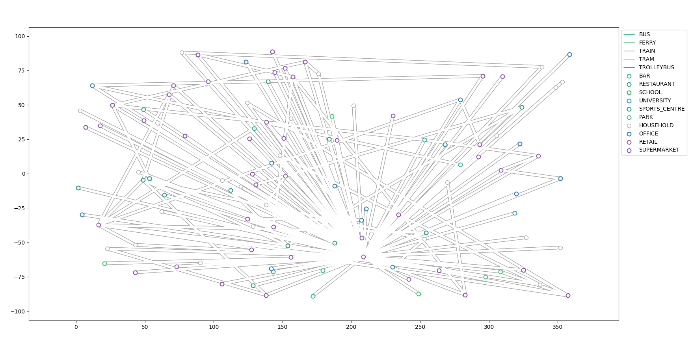
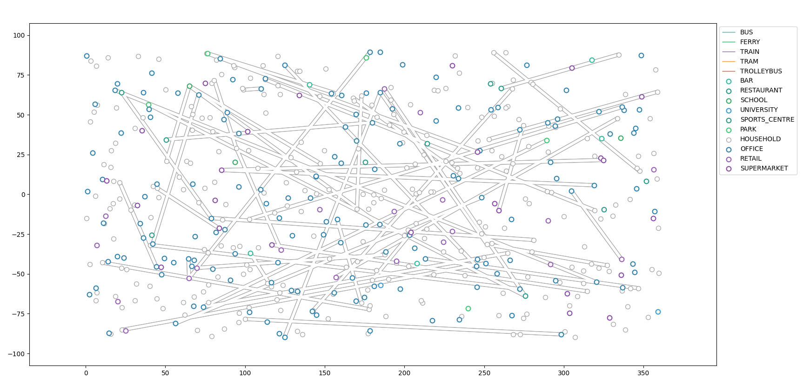
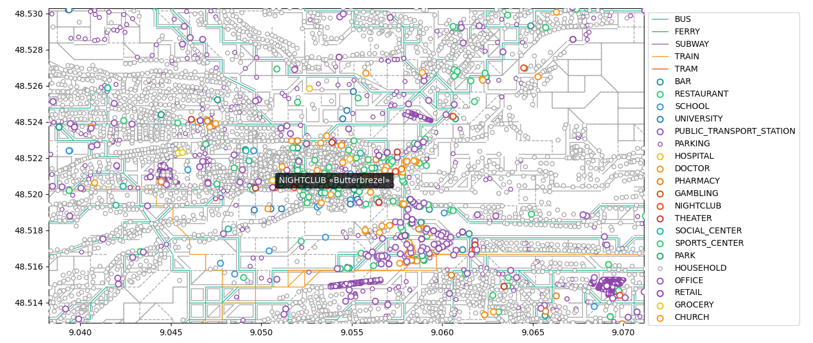

City
====

.. contents::
    :local:
    :depth: 1

Introduction
------------

An instance of the class :py:class:`City<city_graph.city.City>` is a representation
of a virtual or real geographical area.
It is mainly defined by its locations, connections between these locations,
and methods to calcualte paths between them.

The next sections provides some examples on how to create simple examples
and more realistic cities.

Locations
---------

Locations in the city can be of any time, the only requirement is for them to be defined
by two coordinates, ``longitude`` and ``latitude``, which should be accessible through ``x``
and ``y`` attributes, respectively.

For conveniency, we have created a :py:class:`Location<city_graph.types.Location>` class:

.. code:: python

    from city_graph.types import Location, LocationType

    l0 = Location(LocationType.HOUSEHOLD,(0, 0), name="l0")
    l0 = Location(LocationType.HOUSEHOLD,(181.7, 90.5), name="l1")

The first argument of the constructor is a member of the enumeration
:py:class:`LocationType<city_graph.types.LocationType>`.

Building a city from data
-------------------------

One can create a city for which the locations and connections are predefined
using the :py:func:`build_from_data<city_graph.city.City.build_from_data>` class method.

Let's first create the locations:

.. code:: python

    l0 = Location(LocationType.HOUSEHOLD, (10, 20), name="l0")
    l1 = Location(LocationType.PHARMACY, (11, 18.5), name="l1")
    l2 = Location(LocationType.SUPERMARKET, (14, 5), name="l2")
    l3 = Location(LocationType.PUBLIC_TRANSPORT_STATION,(7, -5), name="l3")
    locations = (l0,l1,l2,l3)

The connections are distionnary where the keys are the pair of locations to connect
and the values 2-tuples containing:

* the connection type
* a dictionary for the extra attributes of the connection

The connection type can be defined using the enumeration
:py:class:`TransportType<city_graph.types.TransportType>`.

.. code:: python

    from city_graph.types import TransportType

    connections = {
        (l0,l1): (TransportType.ROAD, {'distance': 0.1})
        (l2,l3): (TransportType.ROAD, {'distance': 0.5})
        (l3,l1): (TransportType.ROAD, {'distance': 0.25})
    }

Finally, the city can be built:

.. code::

    from city_graph.city import City

    small_city = City.build_from_data('small', locations, connections)

Building a random city
----------------------

One can also create a randomly initialized city using
the :py:func:`build_random<city_graph.city.City.build_random>` class method.
The only information the user must provide is the type and number of locations the city should contain.
For this purpose, one should use the enumeration
:py:class:`LocationDistribution<city_graph.types.LocationDistribution>`:

.. code:: python

    from city_graph.types import LocationDistribution

    medium_dist = LocationDistribution(
        household=25, office=15, school=3, university=2,
        supermarket=25, retail=20, sports_centre=5, park=5,
        restaurant=5, bar=5
    )

By default, all values are initialized to 0.
The city can then be built easily:

.. code:: python

   medium_city = City.build_random('medium', medium_dist)

By default, the energy algorithm (``ref``) will be run until all locations have
at least one connection. Using the plotter tool (``ref``), one can obtain a similar plot:

One can also create a bigger city and specify the parameters for the algorithm:

.. code:: python

   # You can use the default distribtion
   from city_graph.city import DEFAULT_LOCATION_DISTRIBUTION

   print("Creating city with", sum(DEFAULT_LOCATION_DISTRIBUTION.values()), "locations")
   bigger_city = City.build_random(
        'bigger', DEFAULT_LOCATION_DISTRIBUTION, max_iterations=10, connections_per_step=5)

which would produce a city with some isolated locations:

Importing a city from OpenStreetMap
-----------------------------------

One can also import the city from OpenStreetMap. This is done with via
function :py:func:`city_graph.importer.import_osm_data()`. The only
required argument is the name of the city (or a place in general --
you can import a single city district as well). The execution time and
memory required depend very much on the city size and on how
responsive is OSM's Overpass API at the moment.

For example, you can use the code below to import data for city of
Tübingen (it will take a couple of minutes)

.. code:: python

   from city_graph import importer
   from city_graph import plotter

   from matplotlib import pyplot as plot

   city = importer.import_osm_data("Tuebingen")
   plotter.plot_city(city)
   plot.show()

By running this you should get a plot similar to the one below

A medium-sized city like Stuttgart takes around 15 minutes and is
possible to do on a laptop with 8 Gb of memory. For a larger city --
Berlin for example -- we don't have any data since it does exhaust all
the memory on the developer's laptops and then crashes. But it should
be possible to do on a reasonable desktop machine.

By default the data is subsampled on a square grid with a fixed step
size of 100 meters. You can change this by passing a custom resolution

.. code:: python
   city = importer.import_osm_data("Tuebingen", resolution=50)

References
----------

.. automodule:: city_graph.city
   :members:
   :member-order: bysource
   :exclude-members: __weakref__

.. automodule:: city_graph.types
   :members:
   :member-order: bysource
   :exclude-members: __weakref__
