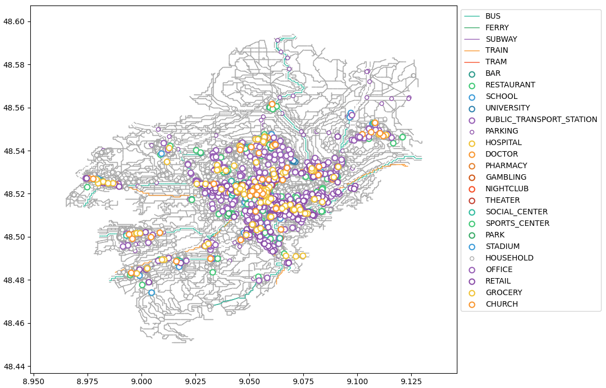

.. _demos:

Demonstrations
==============

.. contents::
    :local:
    :depth: 1

Some demonstrations are provided in order to show the features and capabilities of the framework.

Random city
-----------

The ``city_graph_demo`` demonstration simulates 1000 people moving around a city
built randomly. More details can be found in the file ``city_graph_demo``.

To run the demo, simply do:

.. code::

    $ python city_graph_demo

Real city
---------

The ``tuebingen`` demo generates a representation of Tuebingen using imported data
from `OpenStreetMap <https://www.openstreetmap.org/>`_.

To run the demo, simply do:

.. code::

    $ python tuebingen

After a few minutes, it should produce the following plot:

